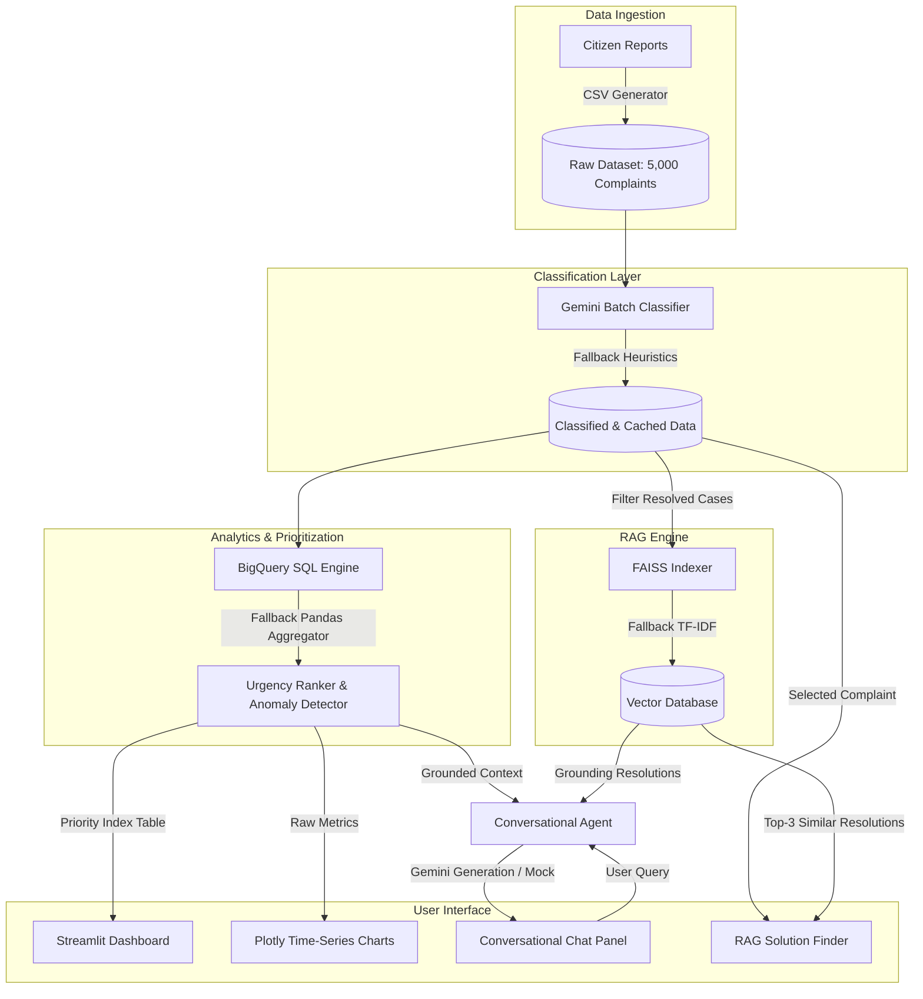

# 🏙️ CityPulse AI: Conversational Civic Intelligence Platform

**CityPulse AI** is a full-stack conversational civic intelligence platform built for **municipal ward officers**. Officers receive high volumes of citizen complaints (potholes, garbage overflow, water leaks, streetlight outages) from multiple channels and struggle to prioritize their daily responses or identify structural spikes. 

CityPulse AI resolves this by automatically analyzing complaint patterns, computing a **weighted urgency priority index**, flagging anomalies, indexing historical resolutions using **RAG (Retrieval-Augmented Generation)**, and exposing a **grounded conversational assistant** to answer complex questions using real-time spatial and time-series data.

---

## 🏗️ System Architecture

The following diagram illustrates how the layers of CityPulse AI interact. The platform features robust **zero-config fallbacks** for BigQuery, Gemini API, and FAISS to ensure it runs seamlessly in offline/mock modes during judging.



---

## ⚡ How BigQuery + Gemini + RAG Work Together

1. **The Classification Hook**: Each raw complaint is analyzed by a batching engine. Gemini classifies its primary category, estimates its urgency severity (1 to 5), and detects citizen sentiment.
2. **The Analytics Engine**: The system runs time-series window functions (BigQuery SQL `LAG` or Pandas local equivalent) to group complaints per ward per week and compute the **Week-over-Week (WoW) Growth Percentage**. 
3. **The Priority Index**: Wards are prioritized dynamically using the formula:
   $$\text{Urgency Score} = (\text{Open Complaints} \times 0.4) + (\text{Average Urgency} \times 10) + (\max(0, \text{WoW Spike }\%) \times 0.2)$$
   Any ward/category with a WoW spike $>50\%$ is flagged as an anomaly.
4. **The RAG Grounding Loop**: When an officer views an open complaint or asks the conversational assistant a question, the **CivicRAG** indexer queries the vector space of *resolved* complaints (combining `description_text` + `resolution_notes`). It returns the top-3 most relevant past actions to recommend standard operating procedures.
5. **The Grounded Chat**: The conversational assistant collects the active ward rankings, current weekly spikes, and retrieved RAG results, packing them into a **grounding system prompt** for Gemini. Gemini synthesizes a direct, data-backed operational response.

---

## 🚀 Getting Started

### 📋 Prerequisites
- Python 3.8 to 3.13
- Virtual Environment tool (`venv`)

### ⚙️ Installation

1. Clone or navigate to the project directory:
   ```bash
   cd citypulse-ai
   ```

2. Create a virtual environment and activate it:
   ```bash
   python -m venv venv
   # On Windows:
   venv\Scripts\activate
   # On macOS/Linux:
   source venv/bin/activate
   ```

3. Install the dependencies:
   ```bash
   pip install -r requirements.txt
   ```

4. Configure environmental variables (Optional - falls back to local mocks if skipped):
   Copy `.env.example` to `.env` and fill in your Gemini API key and BigQuery settings:
   ```bash
   copy .env.example .env
   ```

### 🧪 Run Verification Tests
Verify all layers (Data, Classification, RAG, Analytics, and Agent) are working correctly:
```bash
python run_tests.py
```

### 🖥️ Run the Streamlit Dashboard
Launch the dashboard in your web browser:
```bash
streamlit run app.py
```

---

## 💬 Sample Queries and Grounded Answers

### Query 1: *"Which wards need urgent attention this week?"*
* **Context**: Analytics detects a massive WoW complaint volume increase in Ward 4.
* **Grounded Answer**:
  > 🤖 **CityPulse AI** - Grounded Response for *Week of 2026-06-29*
  > 
  > Based on our latest analytics, **Ward 4** requires the most **urgent attention** with an Urgency Score of **165.99**.
  > 
  > **Key Drivers for Ward 4:**
  > * **Open Complaints**: 177 active cases.
  > * **Average Severity**: 3.42/5.
  > * **WoW Trend**: A sharp spike of **+304.8%** in complaints.
  > * **Anomalies**: Significant spikes detected in: *pothole (+458%), streetlight (+233%), water_leak (+100%)*.
  > 
  > Second in priority is **Ward 8** (Urgency Score: 41.66), which has 22 open complaints.

### Query 2: *"What is causing the spike in Ward 4 and how should we fix it?"*
* **Context**: Ward 4 has an active pothole spike of +458%. RAG retrieves historical pothole paving resolutions.
* **Grounded Answer**:
  > 🤖 **CityPulse AI** - Grounded Response for *Week of 2026-06-29*
  > 
  > ### Status Report for **Ward 4**
  > * **Priority Rank**: #1 of 10
  > * **Urgency Score**: **165.99**
  > * **Open Cases**: 177 complaints currently active.
  > * **Trend**: Complaint volume grew by **304.8%** week-over-week.
  > * **Primary Issue Area**: Category *pothole* represents the highest frequency.
  > * **⚠️ Critical Anomalies**: pothole (+458%), streetlight (+233%), water_leak (+100%)
  > 
  > #### Recommended Resolutions (RAG matches):
  > * **Category: Pothole**
  >   * *Sample Complaint*: "A huge pothole has opened up near Link Road. It is causing traffic delays and is dangerous for two-wheelers."
  >   * *Action Taken*: **Asphalt layering completed over the damaged spots. The stretch is now safe.**
